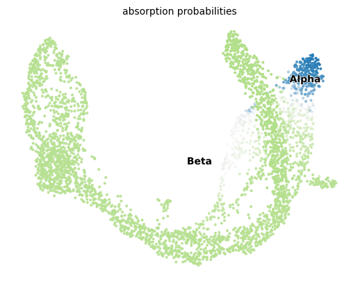
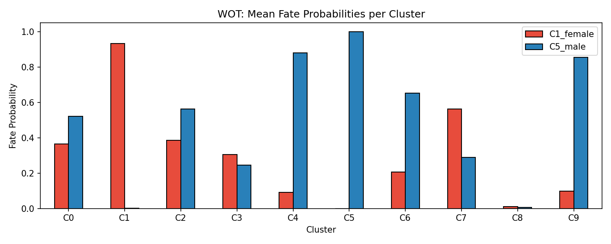

# P. falciparum Gametocyte scRNA-seq 分析工具包

> 复现 **Mohammed et al., *Nature Communications* 2024** ([DOI: 10.1038/s41467-024-51201-3](https://doi.org/10.1038/s41467-024-51201-3)) Fig. 5A，并扩展了三种补充分析方法。

本仓库提供一套完整的单细胞 RNA-seq 分析流程，覆盖从原始计数矩阵到发表级图的全链路，同时验证了三个主流协议工具（CellRank + GAM、WOT、mLLMCelltype）在同一数据集上的可重复性。

---

## 目录

- [本仓库包含什么](#本仓库包含什么)
- [适用数据类型](#适用数据类型)
- [快速开始](#快速开始)
- [环境配置](#环境配置)
- [数据准备](#数据准备)
- [分析流程详解](#分析流程详解)
- [运行脚本说明](#运行脚本说明)
- [自定义数据接入](#自定义数据接入)
- [输出文件说明](#输出文件说明)
- [示例结果](#示例结果)
- [注意事项](#注意事项)
- [Protocol 资源汇总](#protocol-资源汇总)
- [引用](#引用)

---

## 本仓库包含什么

| 脚本 | 功能 | 运行环境 |
|------|------|---------|
| `run_pf_pipeline.py` | **主流程**：P. falciparum 数据完整分析（CellRank + GAM，复现 Fig. 5A）| 项目 venv |
| `run_pipeline.py` | **验证流程**：用 scVelo 内置胰腺数据集验证整套工具链（无需下载数据）| 项目 venv |
| `plot_fig5a_png.py` | **快速出图**：在已有缓存时单独重新生成 Fig. 5A | 项目 venv |
| `test1_extract_markers.py` | 提取各 cluster Wilcoxon marker gene，保存为 JSON | 项目 venv |
| `test2_mllmcelltype.py` | 调用 mLLMCelltype + LLM API 自动注释细胞类型 | miniforge3 |
| `test3_wot_fate.py` | WOT（最优传输）命运分析，独立验证 CellRank 结论 | miniforge3 |

---

## 适用数据类型

### 可以处理的 scRNA-seq 数据

| 平台 / 来源 | 格式 | 备注 |
|-----------|------|------|
| 10x Chromium | `.h5ad` / `barcodes+genes+matrix.mtx` | 最常见，开箱即用 |
| Smart-seq2 | `.h5ad` / `.csv` count matrix | 本项目包含此类数据 |
| Drop-seq / inDrop | `.h5ad` / `.loom` | 同样支持 |
| Seurat 已处理数据 | `.rds` → 需先转为 `.h5ad` | 用 `SeuratDisk::SaveH5Seurat` 转换 |
| GEO 公开数据集 | `.h5ad` / `filtered_matrix.tsv.gz` | 直接使用 |
| 任何物种 | — | 包括非模式生物（寄生虫、鱼类、昆虫等）|

### 适合回答的生物学问题

- **细胞命运决策**：哪些细胞会分化为哪种终态？（本项目：雌雄配子体）
- **发育轨迹重建**：细胞沿分化路径的基因表达动态
- **关键基因鉴定**：哪些基因驱动特定谱系（lineage driver）
- **细胞类型注释**：基于 marker gene 的自动命名（mLLMCelltype）
- **命运验证**：用两种独立方法（CellRank vs WOT）交叉验证命运结论

### 数据最低要求

```python
adata.X                        # log 归一化表达矩阵（normalize_total + log1p）
adata.obs["clusters"]          # 细胞类型标注（字符串 / categorical）
adata.obsm["X_umap"]           # UMAP 坐标
adata.obsp["connectivities"]   # KNN 邻居图（sc.pp.neighbors 后自动生成）
```

---

## 快速开始

```bash
# 1. 克隆仓库
git clone https://github.com/SHzzzAyys/pf-gametocyte-cellrank-gam
cd pf-gametocyte-cellrank-gam

# 2. 创建并激活环境（Python 3.9）
python -m venv .venv
.venv\Scripts\activate          # Windows
# source .venv/bin/activate     # Linux / macOS

# 3. 安装依赖
pip install pandas==1.5.3 numpy==1.23.5
pip install -r requirements.txt

# 4. 无数据时先用胰腺数据集验证流程（约 30 分钟）
python run_pipeline.py

# 5. 有论文数据时复现 Fig. 5A（见"数据准备"）
python run_pf_pipeline.py
```

---

## 环境配置

### 主流程环境（Python 3.9，项目 venv）

用于 `run_pf_pipeline.py` / `run_pipeline.py` / `test1_extract_markers.py`：

```bash
# 推荐用 conda 创建隔离环境
conda create -n cellrank_pf python=3.9 -y
conda activate cellrank_pf

# 安装顺序重要：先固定 pandas / numba，再装 cellrank
pip install pandas==1.5.3 numpy==1.23.5
pip install numba==0.56.4 llvmlite==0.39.1
pip install scanpy==1.9.8
pip install scvelo==0.2.4
pip install cellrank==1.5.1
pip install pygam==0.8.0
pip install leidenalg==0.9.1
pip install loompy==3.0.6

# 或一次安装
pip install -r requirements.txt
```

> **版本锁定原因**：`cellrank==1.5.1` 的 API 与 `cellrank>=2.0` 完全不兼容（方法名、导入路径均变化），`scvelo==0.2.4` 与 cellrank 1.5.x 配合最稳定。

### 扩展工具环境（Python 3.10+，需 SSL）

用于 `test2_mllmcelltype.py` / `test3_wot_fate.py`（调用外部 API 需要有效 SSL）：

```bash
# 在有 SSL 支持的 Python 环境（如 miniforge3 base）中安装
pip install scanpy mllmcelltype wot statsmodels anthropic
```

> **Windows 提示**：如果项目 venv 的 pip 报 SSL 错误，说明该 venv 的 Python 缺少 OpenSSL DLL。改用 miniforge3 / anaconda 的 base 环境安装扩展工具。

---

## 数据准备

### 论文原始数据（P. falciparum，推荐）

| 文件 | 来源 | 大小 | 用途 |
|------|------|------|------|
| `scenic_out_020223.h5ad` | [Zenodo 7652581](https://zenodo.org/records/7652581) | 298 MB | UMAP / PCA / neighbors / 细胞标注 (C0–C9) |
| `filtered_matrix.tsv.gz` | [GEO GSE226145](https://www.ncbi.nlm.nih.gov/geo/query/acc.cgi?acc=GSE226145) | 5 MB | 原始 UMI 计数矩阵（4555 细胞 × 5019 基因）|
| `cells_metadata.csv` | [Zenodo 7652581](https://zenodo.org/records/7652581) | 1 MB | 细胞元数据（cluster 标注、细胞类型）|

下载后放入 `data/` 目录：

```
data/
├── scenic_out_020223.h5ad       # 298 MB
├── filtered_matrix.tsv.gz      # 5 MB
└── cells_metadata.csv           # 1 MB
```

> **注意**：`scenic_out_020223.h5ad` 中的 `X` 是 z-score 归一化值，没有原始计数。脚本会自动从 `filtered_matrix.tsv.gz` 加载原始 UMI 矩阵并重建 log 归一化表达，同时保留 h5ad 中的 UMAP/PCA/neighbors/标注信息。

### 完整 RNA Velocity 复现（可选）

若要使用 scVelo `latent_time`（比 DPT 更精确），还需下载原始 loom 文件：

| SRA 编号 | 文件名 | 说明 |
|---------|-------|------|
| `SRR23197893` | `possorted_genome_bam_T88Y5.loom` | 10x 数据，Velocyto 产出 |
| `SRR23197894` | `gams_smart.loom` | Smart-seq2 数据，Velocyto 产出 |

合并方法见 `run_pf_pipeline.py` 注释中的 loom merge 步骤。

---

## 分析流程详解

### 主流程（run_pf_pipeline.py）

```
原始计数矩阵（filtered_matrix.tsv.gz）
  + 细胞标注（scenic_out h5ad / cells_metadata.csv）
        │
        ▼
[Scanpy 预处理]
normalize_total → log1p → highly_variable_genes
→ PCA → neighbors → UMAP（从 scenic h5ad 直接转移）
        │
        ▼ ── 自动路线选择 ──────────────────────────────
        │
   Route A：h5ad 含 velocity_graph + latent_time
   → 直接使用已有 velocity 数据
        │
   Route B：h5ad 含 spliced/unspliced layers
   → 重跑 scVelo (moments → velocity → recover_dynamics → latent_time)
        │
   Route C：仅有表达矩阵 + 标注（本项目实际路线）
   → DPT 伪时间（sc.tl.dpt，root = C0 cluster）
   → ConnectivityKernel（图拓扑驱动）
        │
        ▼
[CellRank 1.5.x — GPCCA]
compute_schur(n_components=20)
→ compute_macrostates(n_states=10)
→ set_terminal_states(C1 雌性 / C5 雄性)
→ compute_absorption_probabilities(solver="direct")
→ compute_lineage_drivers()
        │
        ▼
[GAM — cellrank.ul.models.GAM]
gene_trends(genes=ApiAP2_TFs, lineages=["C1","C5"],
            time_key="latent_time", data_key="X")
        │
        ▼
Fig. 5A：ApiAP2 TF 沿伪时间的表达趋势
```

### 扩展分析 1：WOT（test3_wot_fate.py）

```
pf_expr_ready.h5ad（缓存）
        │
        ▼ DPT 伪时间 → 5 个时间区间（等细胞数分箱）
        │
[WOT — Waddington Optimal Transport]
OTModel(epsilon=0.05, lambda1=1, lambda2=50)
→ compute_all_transport_maps()  # 相邻时间点间最优传输矩阵
→ TransportMapModel.fates([C1 pop, C5 pop])
        │
        ▼
命运概率矩阵：每个细胞 → C1(female) / C5(male) 的概率
输出：wot_fate_bar.png / wot_fate_umap.png
```

### 扩展分析 2：mLLMCelltype（test1 + test2）

```
pf_expr_ready.h5ad（缓存）
        │
        ▼ sc.tl.rank_genes_groups(method="wilcoxon")
        │
每个 cluster 的 top-10 marker gene 列表
        │
        ▼ mLLMCelltype.annotate_clusters(provider="deepseek")
        │
细胞类型注释（gametocyte stage II–V）
输出：mllmcelltype_annotations.json
```

---

## 运行脚本说明

### 1. 复现论文 Fig. 5A（主流程）

```bash
python run_pf_pipeline.py
# 首次运行：约 15–20 分钟（含 Schur 分解 5–8 分钟）
# 再次运行：自动加载缓存，约 5 分钟
```

### 2. 验证流程（无需下载数据）

```bash
python run_pipeline.py
# 使用 scVelo 内置胰腺数据集，约 30 分钟
# 验证 CellRank 1.5.x + GAM 整套流程正常工作
```

### 3. 仅重新生成图（有缓存时）

```bash
python plot_fig5a_png.py
# 需要先存在 outputs/pf_expr_ready.h5ad
# 重新跑 DPT + CellRank + GAM，约 10 分钟
```

### 4. mLLMCelltype 细胞类型注释

```bash
# Step 1：提取 marker gene（用项目 venv）
python test1_extract_markers.py
# → 生成 outputs/cluster_markers.json

# Step 2：LLM 注释（用有 SSL 的 Python，需 API key）
# 支持 provider：deepseek / anthropic / openai / qwen / gemini 等
DEEPSEEK_API_KEY=sk-xxx python test2_mllmcelltype.py
# Windows PowerShell：
# $env:DEEPSEEK_API_KEY="sk-xxx"; python test2_mllmcelltype.py
# → 生成 outputs/mllmcelltype_annotations.json
```

支持的 LLM provider（在 `test2_mllmcelltype.py` 中修改 `provider` 参数）：

| Provider | 参数值 | 推荐模型 |
|---------|-------|---------|
| DeepSeek | `"deepseek"` | `deepseek-chat` |
| Anthropic Claude | `"anthropic"` | `claude-haiku-4-5-20251001` |
| OpenAI | `"openai"` | `gpt-4o-mini` |
| 通义千问 | `"qwen"` | `qwen-plus` |

### 5. WOT 命运分析

```bash
# 用有 SSL 的 Python + wot/scanpy/statsmodels 已安装
python test3_wot_fate.py
# → 生成 figures/wot_fate_bar.png / figures/wot_fate_umap.png
```

---

## 自定义数据接入

只需修改 `run_pf_pipeline.py` 顶部的三个变量：

```python
# ── 修改这三行 ────────────────────────────────────────────────
H5AD    = "data/your_data.h5ad"       # 你的 h5ad 文件路径

TERMINAL_STATES = ["TypeA", "TypeB"]  # 终态 cluster 名称
                                       # 对应 adata.obs["clusters"] 中的值

ALL_APAP2 = [                         # 要绘制趋势的基因列表
    "Gene1",
    "Gene2",
    "Gene3",
]
# ─────────────────────────────────────────────────────────────
```

**h5ad 最低要求：**

```python
adata.X                        # log 归一化表达矩阵
adata.obs["clusters"]          # 细胞类型标注（字符串 / categorical）
adata.obsm["X_umap"]           # UMAP 坐标
adata.obsp["connectivities"]   # KNN 邻居图（sc.pp.neighbors 后自动生成）
```

**有以下内容时效果更好：**

```python
adata.obs["latent_time"]       # → 自动走 Route A（最精确的 X 轴）
adata.uns["velocity_graph"]    # → 自动走 Route A
adata.layers["spliced"]        # → 自动走 Route B（重跑 scVelo）
adata.layers["unspliced"]
```

**常见接入场景：**

| 你有什么 | 用哪个脚本 | 需要修改什么 |
|---------|----------|------------|
| 任意 scRNA-seq h5ad + cluster 标注 | `run_pf_pipeline.py` | 3 个变量 |
| Seurat RDS | 先转换：`SeuratDisk::SaveH5Seurat` | 转换后同上 |
| 10x cellranger 输出（barcodes/genes/matrix） | 先用 `sc.read_10x_mtx()` 读入 | 存为 h5ad 后同上 |
| 已有 cluster marker gene 列表 | `test2_mllmcelltype.py` | 修改 `cluster_markers.json` |
| 带时间标签的多时间点数据 | `test3_wot_fate.py` | 修改 `wot_day` 字段赋值逻辑 |

---

## 输出文件说明

### figures/（图像）

| 文件 | 内容 |
|------|------|
| `scvelo_01_velocity_stream.png` | RNA velocity 流场图（Route A/B 时生成）|
| `scvelo_02_macrostates.png` | GPCCA 宏状态 UMAP |
| `scvelo_03_terminal_states.png` | 终态（C1 雌 / C5 雄）UMAP |
| `scvelo_04_abs_probs.png` | 吸收概率（命运概率）UMAP |
| `fig5A_combined_apap2.pdf/.png` | **Fig. 5A**：5 个 ApiAP2 基因 × 2 谱系 |
| `fig5A_female_apap2.pdf/.png` | 雌性谱系（C1）ApiAP2 趋势图 |
| `fig5A_male_apap2.pdf/.png` | 雄性谱系（C5）ApiAP2 趋势图 |
| `wot_fate_umap.png` | WOT 命运概率 UMAP（红=女性，蓝=雄性）|
| `wot_fate_bar.png` | WOT 各 cluster 平均命运概率柱状图 |

### outputs/（数据）

| 文件 | 内容 |
|------|------|
| `pf_expr_ready.h5ad` | 预处理缓存（~100 MB），再次运行直接加载 |
| `pf_lineage_drivers.csv` | 各谱系 lineage driver 基因（corr / pval / qval）|
| `cluster_markers.json` | 各 cluster top-10 Wilcoxon marker gene |
| `mllmcelltype_annotations.json` | LLM 自动注释结果 |
| `wot_tmaps/` | WOT 传输矩阵缓存文件（h5ad 格式）|

---

## 示例结果

使用 Zenodo 公开数据（4555 细胞，10x + Smart-seq2）的运行结果：

### CellRank 吸收概率 UMAP

左大簇（C0–C4/C6–C8）= 雌性命运（红），右孤岛（C5/C9 区域）= 雄性命运（蓝）



### Fig. 5A — ApiAP2 TF 表达趋势（雄性谱系 C5）


### WOT 命运概率（独立验证）



| Cluster | 生物学角色 | CellRank 结论 | WOT 结论 |
|---------|----------|--------------|---------|
| C1 | 成熟雌配子 | female 终态 | female=0.93 ✓ |
| C5 | 成熟雄配子 | male 终态 | male=1.00 ✓ |
| C4/C9 | 雄性前体 | → C5 | male=0.88/0.85 ✓ |
| C7 | 雌性偏向中间 | → C1 | female=0.56 ✓ |
| C0 | 早期未定型 | 混合命运 | female=0.36, male=0.52 ✓ |

### mLLMCelltype 自动注释

DeepSeek-Chat 基于 PF3D7_xxx marker gene ID 自动推断：

| Cluster | 注释结果 | 与论文对照 |
|---------|---------|----------|
| C0 | gametocyte stage II/III | ✅ 早期未分化 |
| C1 | gametocyte stage IV/V | ✅ 成熟雌配子 |
| C5 | gametocyte stage V | ✅ 成熟雄配子 |
| C4/C9 | gametocyte stage III/IV | ✅ 雄性前体 |

---

## 注意事项

### Windows 多进程问题

所有脚本均已加 `if __name__ == "__main__"` 保护。自行修改时请确保主逻辑在 `main()` 函数内，否则 Windows 会触发 `RuntimeError: bootstrap` 错误。

### 缓存与运行时间

| 步骤 | 首次耗时 | 有缓存耗时 |
|-----|---------|----------|
| 数据预处理 + neighbors | ~2 分钟 | 秒级（加载缓存）|
| DPT 伪时间 | ~1 分钟 | 每次重算（~1 分钟）|
| GPCCA Schur 分解 | **5–8 分钟** | 每次重算 |
| GAM 基因趋势拟合 | ~3 分钟 | 每次重算 |
| WOT 传输矩阵 | ~2 分钟 | 可手动跳过（已存 tmaps/）|

### CellRank 版本不兼容

| 功能 | 1.5.x（本项目） | 2.x（不适用）|
|------|---------------|-------------|
| 导入路径 | `cellrank.tl.kernels.VelocityKernel` | `cellrank.kernels.VelocityKernel` |
| GPCCA 估计器 | `cellrank.tl.estimators.GPCCA` | `cellrank.estimators.GPCCA` |
| GAM 模型 | `cellrank.ul.models.GAM` | `cellrank.models.GAM` |
| 吸收概率 | `compute_absorption_probabilities()` | `compute_fate_probabilities()` |

### WOT 与 anndata 兼容

WOT 1.0.8 使用已废弃的 `anndata.read()` 接口（在 anndata >= 0.10 中移除）。`test3_wot_fate.py` 已内置兼容 patch：

```python
if not hasattr(anndata, 'read'):
    anndata.read = anndata.read_h5ad
```

---

## Protocol 资源汇总

29 个 scRNA-seq 分析相关 GitHub 仓库的分类注释与对比，见 **[PROTOCOLS.md](PROTOCOLS.md)**。

覆盖 8 大分类：教程 / 上游定量 / 核心框架 / RNA Velocity / 细胞命运 / GRN / 细胞注释 / 可视化，每个仓库均有功能注释、适用场景、与替代品对比、推荐评级。

---

## 引用

```bibtex
@article{mohammed2024single,
  title={Single-cell transcriptomics reveals the architecture of the Plasmodium falciparum gametocyte sex determination network},
  author={Mohammed, Joanah and others},
  journal={Nature Communications},
  year={2024},
  doi={10.1038/s41467-024-51201-3}
}
```
