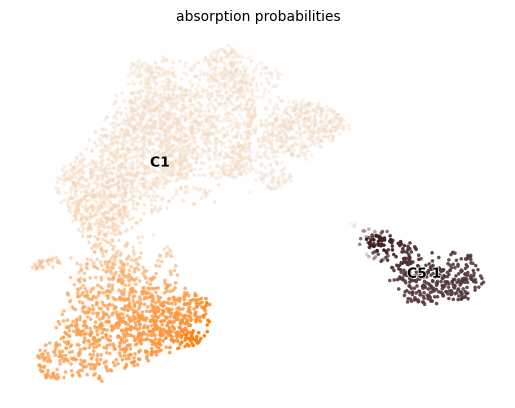
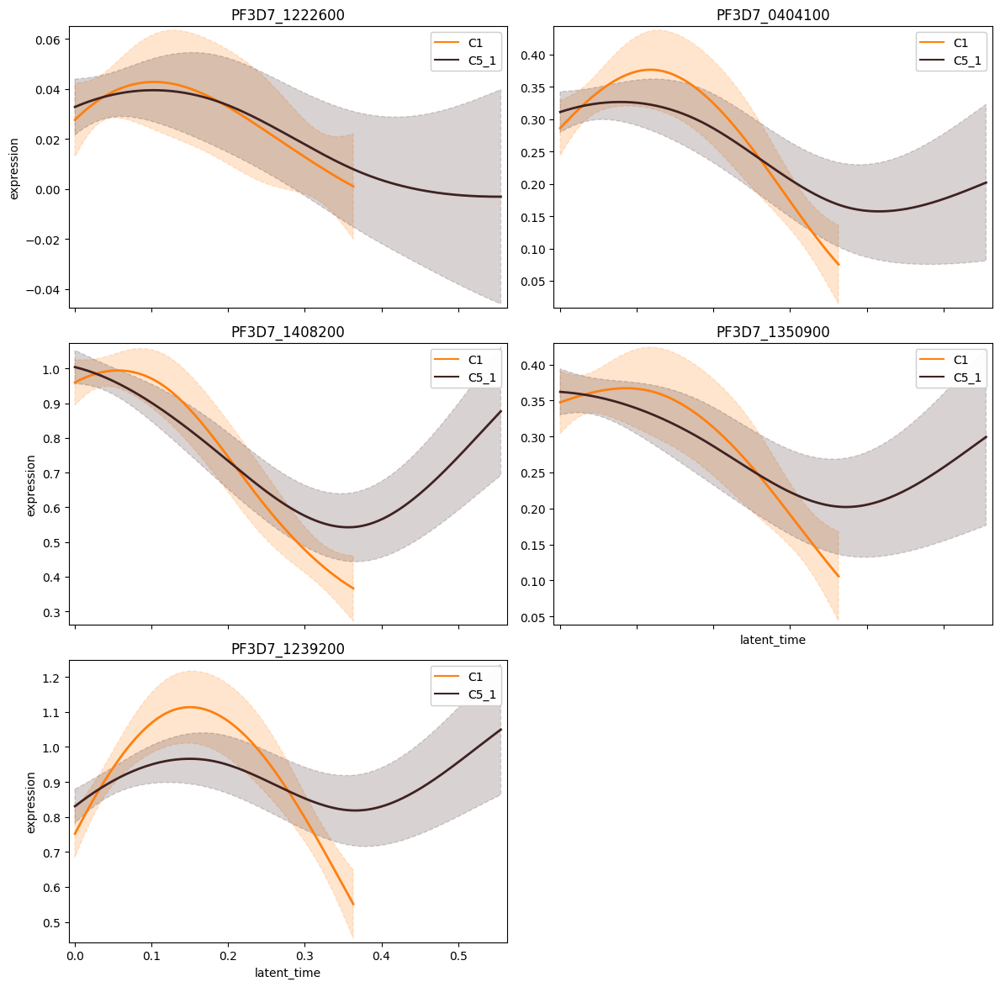
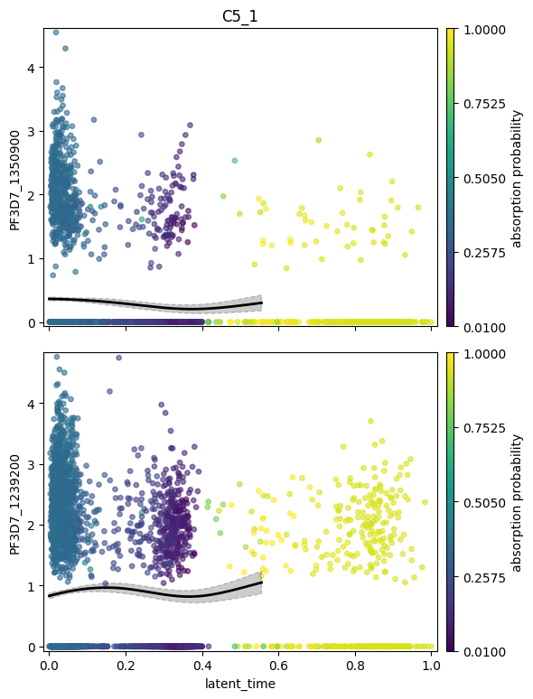

# P. falciparum Gametocyte scRNA-seq — CellRank + GAM Pipeline

复现 **Mohammed et al., *Nature Communications* 2024** ([DOI: 10.1038/s41467-024-51201-3](https://doi.org/10.1038/s41467-024-51201-3)) 中 **Fig. 5A** 的 ApiAP2 转录因子表达趋势分析。

完整复现流程：单细胞表达矩阵 → scVelo RNA velocity → CellRank GPCCA 命运概率 → GAM 基因趋势图。

---

## 目录

- [分析框架](#分析框架)
- [环境配置](#环境配置)
- [数据准备](#数据准备)
- [运行方法](#运行方法)
- [自定义数据](#自定义数据)
- [输出说明](#输出说明)
- [示例结果](#示例结果)
- [注意事项](#注意事项)

---

## 分析框架

```
原始计数矩阵 (h5ad / loom)
        │
        ▼
[Scanpy 预处理]
normalize_total → log1p → PCA → neighbors → UMAP
        │
        ▼ （有 spliced/unspliced 时）
[scVelo 0.2.4]
moments → velocity → velocity_graph
recover_dynamics → latent_time   ← GAM X 轴
        │
        ▼
[CellRank 1.5.x]
VelocityKernel（或 ConnectivityKernel）
→ GPCCA → compute_macrostates
→ set_terminal_states（C1 雌性 / C5 雄性）
→ compute_absorption_probabilities
→ compute_lineage_drivers
        │
        ▼
[GAM — cellrank.ul.models.GAM]
gene_trends(lineages=["C1","C5"], time_key="latent_time")
        │
        ▼
Fig. 5A：ApiAP2 TF 沿伪时间的表达趋势
```

> **版本锁定**：`cellrank==1.5.1` 的 API 与 2.x 完全不同，不可混用。

---

## 环境配置

```bash
# 1. 创建 Python 3.9 虚拟环境
conda create -n cellrank_pf python=3.9 -y
conda activate cellrank_pf

# 2. 安装依赖（顺序重要）
pip install pandas==1.5.3 numpy==1.23.5
pip install numba==0.56.4 llvmlite==0.39.1
pip install scanpy==1.9.8
pip install scvelo==0.2.4
pip install cellrank==1.5.1
pip install pygam==0.8.0
pip install leidenalg==0.9.1
pip install loompy==3.0.6

# 或者一次性安装（推荐先单独装 pandas/numba）
pip install -r requirements.txt
```

> **Windows 用户**：如遇 SSL 错误，在 pip 命令末尾加 `--proxy ""` 并设置 `$env:NO_PROXY="*"`。

---

## 数据准备

### 论文原始数据（P. falciparum）

| 文件 | 来源 | 大小 | 用途 |
|------|------|------|------|
| `scenic_out_020223.h5ad` | [Zenodo 7652581](https://zenodo.org/records/7652581) | 298 MB | UMAP / PCA / neighbors / 细胞标注 |
| `filtered_matrix.tsv.gz` | [GEO GSE226145](https://www.ncbi.nlm.nih.gov/geo/query/acc.cgi?acc=GSE226145) | 5 MB | 原始 UMI 计数矩阵（4555 细胞 × 5019 基因）|
| `cells_metadata.csv` | [Zenodo 7652581](https://zenodo.org/records/7652581) | 1 MB | 细胞元数据（C0–C9 标注、细胞类型）|

下载后放入 `data/` 目录：

```
data/
├── scenic_out_020223.h5ad
├── filtered_matrix.tsv.gz
└── cells_metadata.csv
```

### 完整复现（含 latent_time）

若要使用 scVelo latent_time（而非 DPT）获得更精确的结果，还需下载原始 loom 文件：

- **10x loom**：SRA `SRR23197893`（`possorted_genome_bam_T88Y5.loom`，Velocyto 产出）
- **Smart-seq2 loom**：SRA `SRR23197894`（`gams_smart.loom`，Velocyto 产出）

合并方法见 `run_pf_pipeline.py` 注释中的 loom merge 步骤。

---

## 运行方法

### 方案 A：论文数据复现（推荐）

```bash
cd pf_gametocyte_reproduce
python run_pf_pipeline.py
```

脚本会自动检测数据状态并选择最优路线：

| 数据状态 | 自动选择的路线 |
|---------|--------------|
| h5ad 含 `velocity_graph` + `latent_time` | Route A：直接使用 velocity |
| h5ad 含 `spliced` / `unspliced` | Route B：重跑 scVelo |
| 仅有表达矩阵 + 标注 | Route C：DPT 伪时间 + ConnectivityKernel |

### 方案 B：胰腺数据集验证（无需下载数据）

```bash
python run_pipeline.py
```

使用 scVelo 内置的胰腺数据集，验证整套 CellRank 1.5.x + GAM 流程，约 30 分钟。

### 方案 C：仅生成 Fig. 5A PNG（已有缓存时）

```bash
python plot_fig5a_png.py
```

需要先完整运行过一次 `run_pf_pipeline.py`（存在 `outputs/pf_expr_ready.h5ad`）。

---

## 自定义数据

将自己的数据接入只需修改 `run_pf_pipeline.py` 顶部的 3 个变量：

```python
# ── 修改这里 ──────────────────────────────────────────────
H5AD    = "data/your_adata.h5ad"          # 你的 h5ad 文件路径

TERMINAL_STATES = ["TypeA", "TypeB"]      # 终态名称（对应 obs["clusters"] 的值）

ALL_APAP2 = [                             # 要绘制趋势的基因列表
    "Gene_1",
    "Gene_2",
    "Gene_3",
]
# ──────────────────────────────────────────────────────────
```

**h5ad 最低要求：**

```python
adata.X              # log 归一化表达矩阵（normalize_total + log1p）
adata.obs["clusters"]  # 细胞类型标注（字符串 / categorical）
adata.obsm["X_umap"]   # UMAP 坐标
adata.obsp["connectivities"]  # KNN 邻居图（sc.pp.neighbors 后自动生成）
```

**可选（效果更好）：**

```python
adata.obs["latent_time"]      # scVelo recover_dynamics 后的潜在时间
adata.uns["velocity_graph"]   # scVelo velocity_graph
adata.layers["spliced"]       # RNA velocity 原料
adata.layers["unspliced"]
```

---

## 输出说明

运行完成后在 `figures/` 和 `outputs/` 中生成以下文件：

### figures/（图像文件）

| 文件 | 内容 |
|------|------|
| `scvelo_pf_macrostates.png` | GPCCA 宏状态 UMAP |
| `scvelo_pf_terminal_states.png` | 终态（C1 雌 / C5 雄）UMAP |
| `scvelo_pf_abs_probs.png` | 吸收概率（命运概率）UMAP |
| `fig5A_combined_apap2.pdf/.png` | **Fig. 5A**：5 个 ApiAP2 基因 × 2 谱系，同图展示 |
| `fig5A_female_apap2.pdf/.png` | 雌性谱系（C1）ApiAP2 基因散点 + GAM 趋势 |
| `fig5A_male_apap2.pdf/.png` | 雄性谱系（C5）ApiAP2 基因散点 + GAM 趋势 |

### outputs/（数据文件）

| 文件 | 内容 |
|------|------|
| `pf_expr_ready.h5ad` | 预处理后的 AnnData 缓存（log 归一化，含 UMAP/neighbors）|
| `pf_lineage_drivers.csv` | 各谱系 lineage driver 基因（corr / pval / qval）|

---

## 示例结果

以下为使用 Zenodo 公开数据（10x，4555 细胞）生成的结果：

**命运概率 UMAP**（左大簇 = 雌性命运，右孤岛 = 雄性命运）



**Fig. 5A — ApiAP2 表达趋势（combined）**



**Fig. 5A — 雄性谱系（C5）**



---

## 注意事项

### Windows 多进程问题

所有运行脚本均已在顶层加 `if __name__ == "__main__"` 保护。**自行修改脚本时，请确保新增的主逻辑代码都在 `main()` 函数内**，否则在 Windows 上会触发 `RuntimeError: bootstrap` 错误。

### 大文件与缓存

- `pf_expr_ready.h5ad`（~100 MB）是第一次运行后的预处理缓存，再次运行会直接加载，无需重复处理
- Schur 分解（`compute_schur`）对 4555 × 4555 矩阵约需 **5–8 分钟**，属正常现象

### CellRank 版本

本项目使用 `cellrank==1.5.1`，其 API 与 `cellrank>=2.0` **完全不兼容**：

| 功能 | 1.5.x | 2.x（不适用）|
|------|-------|------------|
| 导入路径 | `cellrank.tl.kernels.VelocityKernel` | `cellrank.kernels.VelocityKernel` |
| GPCCA 估计器 | `cellrank.tl.estimators.GPCCA` | `cellrank.estimators.GPCCA` |
| GAM 模型 | `cellrank.ul.models.GAM` | `cellrank.models.GAM` |
| 吸收概率 | `compute_absorption_probabilities()` | `compute_fate_probabilities()` |

---

## 引用

```bibtex
@article{mohammed2024single,
  title={Single-cell transcriptomics reveals the architecture of the Plasmodium falciparum gametocyte sex determination network},
  author={Mohammed, Joanah and others},
  journal={Nature Communications},
  year={2024},
  doi={10.1038/s41467-024-51201-3}
}
```
